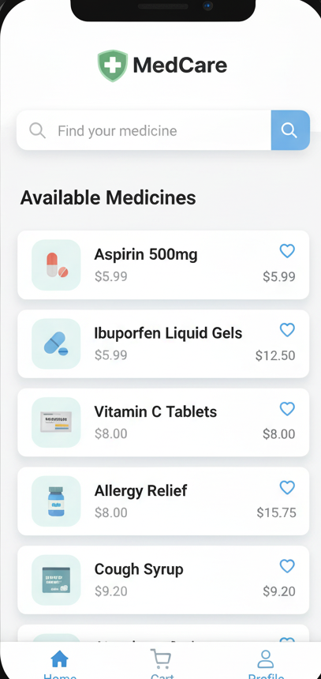
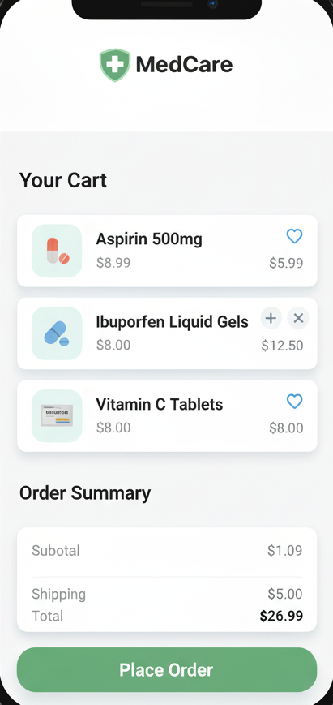

# MedCare – E-commerce Application for Medicines

## Overview
MedCare is a **mobile-friendly e-commerce app** built with **Python and Kivy**, integrated with **Firebase** for backend services. Users can browse medicines by category, add items to a cart, and place orders. The app includes **user authentication**, **cloud storage for product images**, and a **stub for payment integration** (Razorpay).

This project demonstrates **full-stack app development**, **mobile-friendly UI**, and working with **cloud databases and APIs**.

---

## Features
- **User Authentication**: Sign up and login using Firebase Email/Password.  
- **Browse Medicines**: View medicines categorized by type, with search functionality.  
- **Cart & Order Management**: Add items to cart, view cart, and place orders.  
- **Cloud Storage**: Store and retrieve medicine images from Firebase Storage.  
- **Payment Integration Stub**: Placeholder for Razorpay payment gateway.  
- **Mobile-Friendly UI**: Designed using Kivy for desktop and mobile deployment.

---

## Tech Stack
- **Frontend**: Python, Kivy  
- **Backend & Cloud**: Firebase (Auth, Firestore, Storage)  
- **Payment Gateway**: Razorpay (stub, can be fully integrated)  
- **Version Control**: Git/GitHub

---

